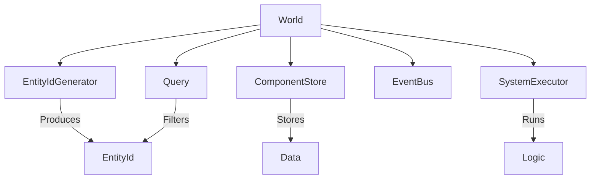
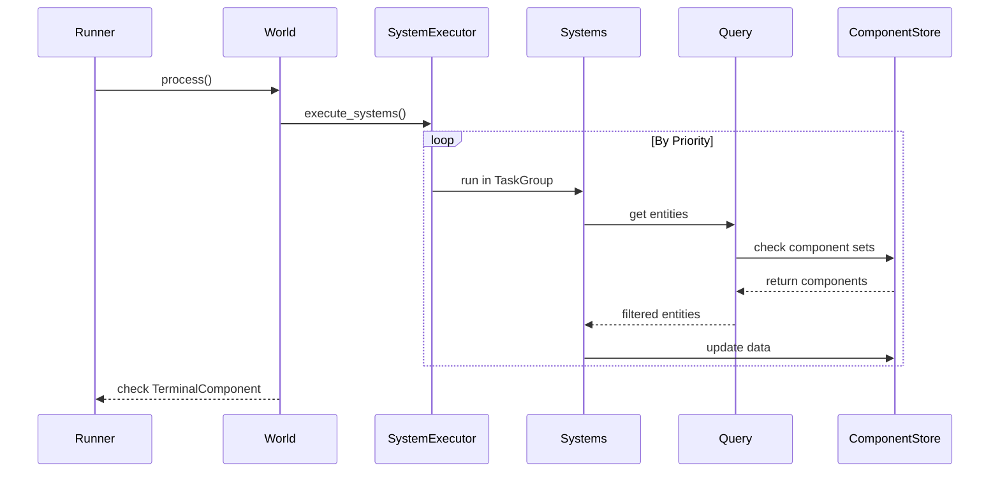

# Architecture

This document explains the core architecture of the ECS framework for LLM agents. It covers the motivation behind using an Entity Component System and details how the different parts of the system interact.

## Why ECS for LLM Agents?

Traditional agent frameworks rely on complex class hierarchies like Agent, ToolAgent, and MemoryAgent. This approach often creates rigid code where adding new features requires changing the base class or managing multiple inheritance. 

The Entity Component System (ECS) paradigm shifts the focus from what an agent is to what an agent has. In this architecture, an agent is simply a unique ID. Its capabilities come from the data attached to it. If you want an agent to use tools, you add a tool component. You can change these capabilities at runtime by adding or removing components. This flexibility makes it easier to test individual systems and run logic in parallel.

Benefits include:
- **Composition over Inheritance**: Build complex agents by combining simple data components.
- **Runtime Capability Changes**: Dynamically add or remove features like memory or tool access while the agent is running.
- **Isolated Testability**: Test business logic in systems independently from agent state.
- **Parallel Execution**: Run independent systems simultaneously to improve performance.

## Architecture Overview

The World acts as the central container that coordinates all other parts of the system.

In this model:
- **Entities** are unique identifiers used to group data.
- **Components** are pure data structures with no logic.
- **Systems** contain the logic and operate on entities that have specific component sets.

## Data Flow

The system operates in discrete steps called ticks. Each tick represents a full pass through the active logic.

Typical tick cycle steps:
1. The Runner initiates the process by calling `world.process()`.
2. The `SystemExecutor` organizes registered systems by their priority values.
3. Systems with the same priority run at the same time using `asyncio.TaskGroup`.
4. Systems use the `Query` tool to find entities that match specific component requirements.
5. After processing logic, systems update data in the `ComponentStore` or trigger events through the `EventBus`.
6. The Runner checks for a `TerminalComponent` at the end of every tick to decide whether to stop the execution loop.

## System Execution Order

Systems run based on their priority. Lower numbers execute first. We recommend the following priority ordering for agent workflows:

- **Priority 0**: `ReasoningSystem` or `PlanningSystem`. These systems usually handle LLM calls to decide the next action.
- **Priority 5**: `ToolExecutionSystem` or `CollaborationSystem`. These handle the actual work or interactions with other agents.
- **Priority 7**: `ReplanningSystem`. This checks results and updates the plan if needed.
- **Priority 10**: `MemorySystem`. This persists important information to long-term storage.
- **Priority 99**: `ErrorHandlingSystem`. This runs last to catch and process any issues that occurred during the tick.

## Event System

The `EventBus` provides a typed pub/sub mechanism for asynchronous communication between systems. Subscribers register for specific event type classes. When an event is published, the bus triggers all handlers associated with that exact type.

Common event types include:
- `ConversationTruncatedEvent`: Triggered when context limits are reached.
- `ErrorOccurredEvent`: Published when a system encounters an exception.
- `MessageDeliveredEvent`: Sent when a message reaches its destination.
- `PlanStepCompletedEvent`: Published after a plan step finishes successfully.
- `PlanRevisedEvent`: Triggered when an agent changes its strategy.

## Design Decisions

Several key decisions guide the implementation of this framework:

- **Performance**: Components use `@dataclass(slots=True)` to keep memory usage low and access fast.
- **Asynchrony**: Every system implements the `async def process(self, world: World) -> None` protocol to ensure non-blocking execution.
- **Storage**: `ComponentStore` stores data in a `dict[type[Any], dict[EntityId, Any]]` structure. This provides O(1) lookup speed for any component given its type and entity ID.
- **Filtering**: `Query` operations find entities by intersecting sets of component keys. This ensures efficient filtering even as the number of entities grows.
- **Termination**: If an LLM provider runs out of responses, the system adds a `TerminalComponent` with a `provider_exhausted` reason.
- **Error Pattern**: Systems catch exceptions and add an `ErrorComponent`. The `ErrorHandlingSystem` (priority 99) logs the issue, publishes an `ErrorOccurredEvent`, and removes the component to prevent infinite error loops.

## Related Documents

- [Core Concepts](core-concepts.md)
- [Systems](systems.md)
- [Components](components.md)
